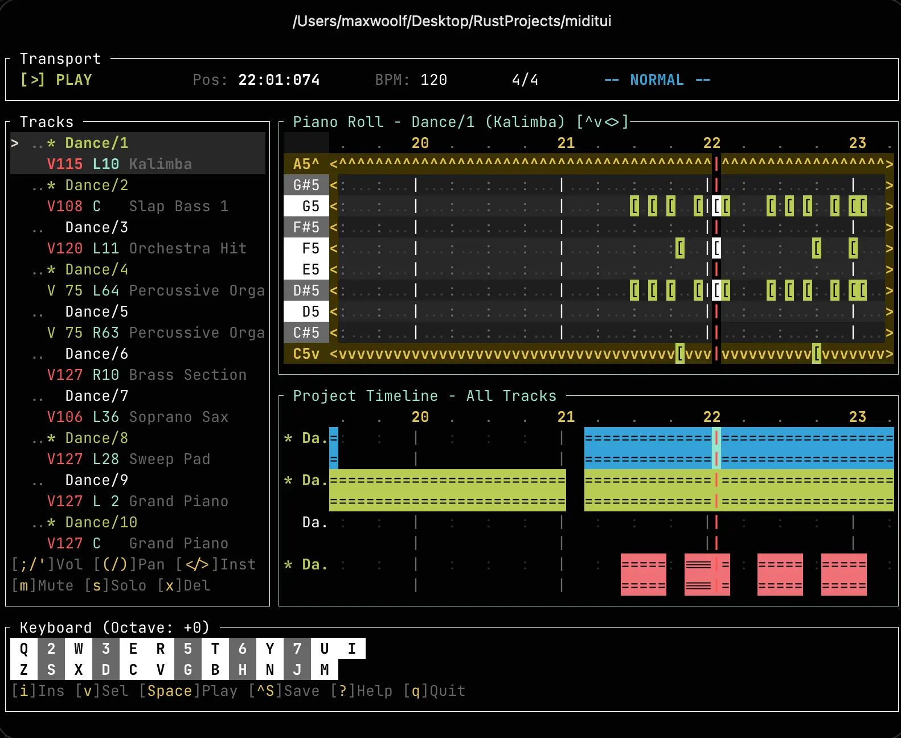

# miditui



[Crates.io](https://crates.io/crates/miditui)

An interactive terminal app/UI for MIDI composing, mixing, and playback—written in Rust.

`miditui` allows for a DAW-like experience in the terminal and has many features that you wouldn't expect a terminal app to have:

- Full terminal mouse support: click, drag, scroll, double-click, right-click all work, which allows you to pan views, select notes, click piano keys to play them
- A piano roll view for showing the notes as they are played in the song
- An Insert mode to press keys on your keyboard (or simply click the piano roll) and create music in real time: Two-octave QWERTY layout (Z-M and Q-I rows) with live audio playback as you type
- A project timeline timeline view to see all the notes
- Low-latency 44.1kHz audio via [rustysynth](https://github.com/sinshu/rustysynth)
- Timeline seeking by clicking the time rulers to skip to any point of the track
- Unlimited MIDI tracks with per-track mute/solo, volume/pan (L/R) controls, and automatic MIDI channel assignment
- Autosave that periodically saves your project and automatically reloads it when restarting the app
- Undo/Redo support to avoid losing work
- Import/Export MIDI and JSON files, plus export the music as a WAV file.

Watch this video to see `miditui` in action (enable sound on the in-line player):

https://github.com/user-attachments/assets/faab0610-e1a8-4c4c-9b94-850fa18aedd3

_**Disclosure:** This crate was coded with the assistance of Claude Opus 4.5, mostly as a personal experiment just to see how well modern coding agents can handle TUIs and I figured a full-on MIDI mixer which has atypical UI requirements would be a more **interesting** test. Opus 4.5 did a good job and after a demo [went viral on X](https://x.com/minimaxir/status/2005779586676842646) people were asking for me to release it, so I decided to spend extra time polishing and comprehensively testing the app before then open-sourcing it. I have written a full analysis of the agentic coding workflow—including the prompts provided to Opus 4.5—in the [agent_notes folder](agent_notes/)._

## Installation

The app binaries can be downloaded from the [Releases page](https://github.com/minimaxir/miditui/releases) for your platform of choice, or by using the following terminal commands:

```sh
# macOS Apple Silicon
curl -sL https://github.com/minimaxir/miditui/releases/latest/download/miditui-macos-arm.tar.gz | tar xz
./miditui

# macOS Intel
curl -sL https://github.com/minimaxir/miditui/releases/latest/download/miditui-macos-intel.tar.gz | tar xz
./miditui

# Linux ARM64
curl -sL https://github.com/minimaxir/miditui/releases/latest/download/miditui-linux.tar.gz | tar xz
./miditui

# Linux x64
curl -sL https://github.com/minimaxir/miditui/releases/latest/download/miditui-linux.tar.gz | tar xz
./miditui

# Windows (can also double-click the .exe)
.\miditui-windows.exe
```

If Rust is installed, you can install the crate directly via `cargo`:

```bash
cargo install miditui
```

Additionally, a SoundFont file (`.sf2`) is required to run `miditui`. There are many free SoundFonts which are commercially friendly for music generation: a small one is `TimGM6mb.sf2` ([6 MB, direct download link](https://sourceforge.net/p/mscore/code/HEAD/tree/trunk/mscore/share/sound/TimGM6mb.sf2?format=raw)), while a more robust SoundFont is [GeneralUser GS](https://github.com/mrbumpy409/GeneralUser-GS/tree/main) ([32.3 MB, direct download link](https://github.com/mrbumpy409/GeneralUser-GS/raw/refs/heads/main/GeneralUser-GS.sf2)).

It is also strongly recommended to use a terminal that support horizontal mouse scrolling which not all do: I recommend [Ghostty](https://ghostty.org).

## Example Usage

To run `miditui`: if you downloaded the binary, run it in the terminal with `./miditui`. If you installed via Rust, run `cargo run`. On the first load, the app will prompt you to select the path to a SoundFont: the path to the SoundFont will be saved for future runs.

`miditui` opens in `Normal Mode`, with a combined `Piano Roll` and `Project Timeline` view. In this mode, you can move the cursor with the arrow keys and press `Enter` to insert notes, or you can double click where you want to insert the note, or even drag-and-drop notes. This mode also allows for the most keyboard shortcuts, such as `g` to switch cycle between views.

To play your composition, press `Space`. You can click the time ruler to seek to a specific point and `.` to reset to the start.

`Insert Mode`, entered by pressing `i` or right-clicking, allows inserting notes with less friction and playing back notes in real time as if the keyboard was a piano. Single-clicking areas on the piano roll immediately inserts notes, and playing multiple notes on the keyboard at the same time also works.

With a Track selected, you can press `a` to add a track, `m` to mute a track, or `s` to play the track as a solo.

You can save your project to a JSON/MIDI file with `Ctrl+S` or export it as an uncompressed `.wav` file with `e`.

There are a _very_ large number of keyboard shortcuts that are too big to fit into the README: press `?` in the app for documentation. Experimentation is encouraged, and if you break something, `Ctrl+Z` to Undo!

If you want example MIDIs for testing and opening them with `Ctrl+O`, you can view the [/examples folder](examples/).

## Notes

- Due to variations in terminal support, key release events [cannot be reliably detected](https://stackoverflow.com/a/74422335), which means the piano-key-input intentionally does not support holding keys to extend notes, unfortunately.
- Music files are autosaved as a bespoke `.oxm` binary file, which essentially wraps the song metadata with a few added fields outside of the MIDI spec, such as the SoundFont path and the mute/solo status of each track.
- All colors within `miditui` are based on your defined terminal colors. The Ghostty terminal theme used in the example image/video is by David Crespo and is available [here](https://github.com/david-crespo/dotfiles/blob/main/ghostty/config), although the examples use the [Jetbrains Mono](https://www.jetbrains.com/lp/mono/) fontface instead.
- The music file played in the demo video is `Dance.mid` by S. Christian Collins, located [here](https://github.com/mrbumpy409/GeneralUser-GS/tree/main/demo%20MIDIs) with other demo MIDIs.

## License

MIT
